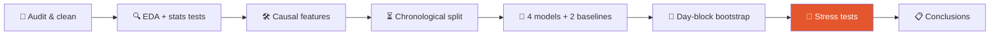

<div align="center">

# 🕵️‍♂️ Catch the Thief
### Credit-card fraud detection on BankSim, with a critical eye

*594,643 payments · 180 days · 7,200 frauds hiding in a haystack of 587,443 honest transactions*


</div>

---

## 🎯 The one-minute pitch

Most fraud notebooks stop at *"Random Forest got 99% accuracy!"*. That number is meaningless here: a model that says **"never fraud"** already scores **98.8%**.

This project goes the other way. It builds four models, then **tries to break its own results**: does it hold up in time, on hard cases, across demographic groups, and in dollars rather than percentages? The answers are often more interesting than the leaderboard.

> 💡 **Headline finding:** the best model beats a one-line rule ("alert if amount ≥ $105") by only about 3 points of fraud-dollar savings, but it does so with **roughly half the false alerts** and far better recall.

---

## 🗺️ The journey



| Stage | What happens |
|---|---|
| 🧹 **Audit** | Strips quoting, drops constant zip codes, recodes unknown age to `7`, and checks the data against its own documentation (found 4,112 customers, not 4,109). |
| 🔍 **EDA** | Imbalance, daily structure, category/amount/merchant/demographic effects, each with a statistical test and a confounding check. |
| 🛠️ **Features** | History-based signals computed **only from the past**, with an automated causality test that fails if any feature peeks at the future. |
| ⏳ **Split** | Train days 0-119 → tune 120-149 → test 150-179, touched once. |
| 🤖 **Models** | Logistic Regression · Decision Tree · Random Forest · Gradient Boosting. |
| 🧪 **Uncertainty** | Bootstrap over whole *days* (not rows) for honest confidence intervals and paired model comparisons. |
| 🔬 **Stress tests** | Hard subset, error analysis, calibration, stability, fairness, ablations, cost sensitivity. |

---

## 🏆 Results (untouched test window, 1,200 frauds)

| Model | PR-AUC | 95% CI | Precision | Recall | Alerts | 💰 Saved |
|---|---|---|---|---|---|---|
| 🥇 **Gradient Boosting** | **0.956** | 0.949-0.963 | 0.910 | 0.860 | 1,900 | $590.6k |
| 🥈 Random Forest | 0.928 | 0.920-0.939 | 0.881 | 0.837 | 1,875 | $589.4k |
| 🥉 Logistic Regression | 0.922 | 0.911-0.934 | 0.848 | 0.838 | 2,046 | $589.5k |
| Decision Tree | 0.878 | 0.866-0.894 | 0.864 | 0.781 | 2,248 | $584.9k |
| *rule: amount only* | *0.704* | *0.682-0.734* | *0.769* | *0.592* | *3,520* | *$573.7k* |
| *rule: category prior* | *0.464* | *0.427-0.499* | *0.555* | *0.508* | *8,533* | *$549.9k* |

Thresholds were chosen on validation data only, to minimise `missed-fraud $ + $5 × alerts`.

---

## 🧠 What the critical thinking uncovered

<table>
<tr>
<td width="50%" valign="top">

### 🎭 Accuracy and ROC-AUC lie here
**89.5%** of transactions sit in categories that *never* contain fraud. ROC-AUC sits at 0.998-0.999 for four quite different models. On the at-risk subset, one baseline's ROC-AUC falls from **0.98 to 0.78**.

### 💵 Ranking ≠ money
Gradient Boosting's lead is statistically solid, yet worth only **~$1.2k** (0.2% of losses) over Logistic Regression.

### 🏪 One feature carries the model
Removing **merchant ID** costs 0.065 PR-AUC, more than all behavioural features combined. Probably a simulator artefact.

</td>
<td width="50%" valign="top">

### ⚖️ Fairness audit
Women are flagged more often (false-positive ratio **1.41×**). Dropping age and gender leaves accuracy unchanged and narrows the gap to **1.27×**. Verdict: remove them.

### 🕳️ The frauds that slip through
Only 25 of 1,200 are missed, worth **$1,375** in total. Rational under a dollar-cost objective, but small frauds can be card-testing, so it is a *policy* choice.

### 🧊 Too-perfect data
Exactly **40 frauds on each of 180 days**. Stable-over-time results prove the pipeline works, not that it survives real drift.

</td>
</tr>
</table>

---

## 🚀 Quick start

```bash
# 1. Get the data (BankSim, file: bs140513_032310.csv) and put it next to the notebook
# 2. Install
pip install numpy pandas scipy scikit-learn matplotlib seaborn jupyter

# 3. Run
jupyter notebook bankSim_fraud_detection_notebook.ipynb
```

| Setting | Where | Default |
|---|---|---|
| `QUICK_RUN` | environment variable (`QUICK_RUN=1`) | off. Smoke test on 700 customers, ~2 min |
| `REVIEW_COST` | setup cell | `$5` per alert (**an assumption**, tested from $1 to $100) |
| `TRAIN_END`, `VAL_END` | setup cell | days 120 and 150 |
| `SEED` | setup cell | `42` |

Full run takes about **17 minutes on a single CPU core** and runs end to end with fixed seeds, so results reproduce.

> 👀 Just want to read? Open the `.html` version. All outputs are already embedded.

---

## 📁 What's inside

```
├── bankSim_fraud_detection_notebook.ipynb   # the full, executed notebook
├── bankSim_fraud_detection_notebook.html    # read-only copy with all outputs
└── README.md
```

The notebook is organised into ten sections, from setup to conclusions. Every section ends with a **"Critical reading"** note separating what the data *shows* from what is merely a property of the simulator.

---

## ⚠️ Honest limitations

- 🧪 **Synthetic, stationary data.** No bursts, no adaptation, no drift.
- 🎯 **Simulator-driven signal.** Merchant identity and large amounts dominate. Real fraudsters rotate merchants and probe with small amounts.
- 🔎 **No rich context.** No time of day, device, location or channel.
- 💲 **Assumed costs.** $5 per review, no churn or friction cost for false alarms.
- ⏱️ **Instant, perfect labels.** Production labels arrive late and noisy.

## 🔭 Where to go next

1. Rolling-origin backtest on real, delayed-label data.
2. Replace raw merchant IDs with smoothed, past-only merchant risk scores and test on unseen merchants.
3. Measure the true cost of a false positive and tune thresholds per segment.
4. Add time-of-day, rolling-window and card-testing features.
5. Calibrate scores (isotonic) if probabilities feed downstream decisions.

---

<div align="center">

**Built to answer not only "how good is the model?" but "how much should we trust that number?"**

</div>
